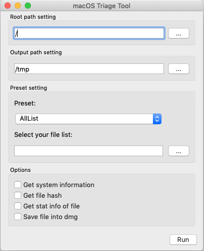

[](https://github.com/Recruit-CSIRT/macOSTriageTool/releases/latest)
[](https://github.com/Recruit-CSIRT/macOSTriageTool/blob/master/LICENSE)

# macOS Triage Tool

A DFIR tool to collect artifacts on macOS


## Abstract

`macOS Triage Tool`(`MTT`) is a DFIR tool to collect artifacts on macOS.  
The purpose of this tool is to collect important files with their directory structure for the investigation.

`MTT` has not oly a CLI edition but also a GUI edition to help people who does not have a macOS forensics knowledge.  
You can easily start collecting artifacts to run a single binary or a single App on the target machine. 

## Features

- Offering GUI and CLI
    - You can use this along to your use case. For instance, use a CLI tool when operating from remotely.

- Keep directory structure
    - `MTT` collects files with their directory structure, so it is possible to parse files by other tool too.
    
- Keep Extended Attribute
    - `MTT` can save evidences to a disk image, so you don't need to concern about the file system of the output device which doesn't keep the extended attribute.  
   
- Four preset
    - You can choose artifacts to collect depends on the situation.
        - `AllList`: Collect all artifacts defined this tool.
        - `Malware`: Collect artifacts for responding a malware incident.
        - `Fraud`: Collect artifacts for responding a internal fraud incident.
        - `macripper`:Collect artifacts for the macripper.
    - Also you can use your custom file list.
    
## Quick Start
`MTT` can work on Mojave and Catarina. 

### CLI
Under the default setting, collect artifacts from root directory and output artifacts to current directory. 
The forensics type is `AllList`.

Note: strongly recommend to run this tools with sudo. 
```
$ sudo ./mtt
```

### GUI
Just click MTT.app, enter the settings and Run.

## Usage

### CLI
```
Usage of mtt:
  -c    Calc the file hash. (default: false)
  -d    Save files into a dmg. (default: false)
  -file string
        Set user custom file list path.
  -i    Get the system information. (default: false)
  -output string
        Set the output path. (default ".")
  -preset int
        Choose forensics type: 0(AllList), 1(Malware), 2(Fraud), 3(macripper), 4(only custom). (default: 0)
  -root string
        Set the evidence root path. (default "/")
  -s    Get the stat info. (default: false)
```

e.g. 
```
$ sudo ./mtt -root / -output /Volumes/USB -preset 2 -file /Volumes/USB/udf.txt -s -c -i -d
```

### GUI



- Root path setting: Set the root directory path of the target.
- Output path setting: Set the output directory path.
- Preset setting:
    - Preset: Choose the forensics type from AllList, Malware, Fraud, macripper, only custom.
    - Select your file list: Choose the your own file list.
- Options:
    - Get system information: Get the system informaino of macOS.
    - Get file hash: Get the file hash(md5) of the artifacts.
    - Get stat info: Get the file stat information of the artifacts. For instance, last access time, modification time and so on.
    - Save file into dmg: Save the artifacts to Disk Image(dmg file).

### How to create your own custom file list
Write the file path to get line by line in text file.
Wildcard(`*`) is supported for the path that can not be fixed.

e.g. : udf.txt
```
/Users/*/Downloads/snork*
/Users/*/Documents/
/Library/LaunchAgents/*.plist
```

### Tips
To save the target file to Disk Image (dmg format), check "Save file into dmg" in "Options".
In my testing, this option allows you to finish the copy faster instead of requiring more disk space.
If the copy destination file system does not support the extended attributes of macOS, sometime copying by diito may fail. However, it may be obtained by using the dmg option.

## Note
These setting are recommended to triage more effectively.
- Disable `SIP`
- Allow Terminal app to have `Full Disk Access`

Please refer the following document for more details.  
[User Guide](https://drive.google.com/drive/folders/15bM7QlCoBxanIqjOw55n_bJDsX4Hjf47)

## Compile

### install of qt
```
$ brew install qt
$ export QT_HOMEBREW=true
$ export GO111MODULE=off; xcode-select --install; go get -v github.com/therecipe/qt/cmd/... && $(go env GOPATH)/bin/qtsetup -test=false
```
### CLI
```
$ make cli
```

### GUI
```
$ make gui
```

## License
This repository is available under the GNU General Public License v3.0

## Author
moniik

